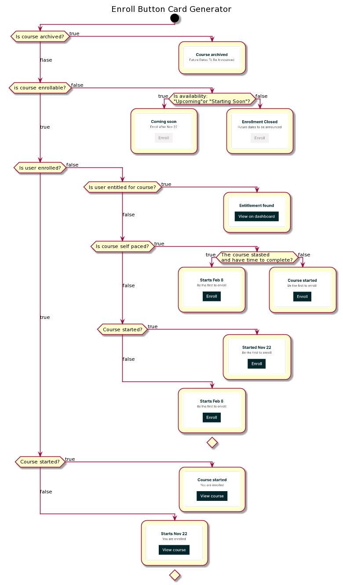

================================
Enroll Button Card Generator
================================
The below plant uml describes how we generate the enrollment button cards.

Also checkout https://miro.com/app/board/uXjVOSN-ZDY=/

PlantUML
::
  @startuml
  !pragma useVerticalIf on

  title
  Enroll Button Card Generator
  end title

  start

  if (Is course archived?) then (true)
    :;
    kill
  (flase) elseif(is course enrollable?) then (false)
    if(Is availability: \n"Upcoming"or "Starting Soon"?) then (true)
      :;
      kill
    else (false)
      :;
      kill
    endif

  (true) elseif(Is user enrolled?) then (false)
    if (Is user entitled for course?) then (true)
      :;      
      kill
    (false) elseif (Is course self paced?) then (true)
        if(The course stasted\nand have time to complete?) then (true)
          :;
          kill
        else (false)
          :;
          kill
        endif
    (false) elseif (Course started?) then (true)
        :;
        kill
    else (false)
        :;
        kill
    endif
  (true)elseif (Course started?) then (true)
    :;
    kill
  else(false)
    :;
    kill
  endif
  @enduml

|enroll_button_card_generator|

